# 领域数据模型

> 本文描述领域所有权和关系，不等同于最终 PostgreSQL DDL。物理表、索引、ORM 与分区策略在对应 Slice 设计，但不得破坏本文件不变量。



## 1. 模型分离

同一个概念有三种表示，禁止复用单一 TypeScript 类型贯穿全栈：

- **Domain Model**：业务语义、不变量和状态转换
- **Persistence Model**：表、外键、索引、JSONB 和 Adapter key
- **Contract Model**：HTTP/SSE/UI 的版本化序列化

映射集中在 Module 内或 Transport Adapter；Provider/ORM 类型不得进入 Domain。

## 2. Identity 与所有权

### Organization

所有企业数据、Policy 和管理操作的隔离范围。核心业务记录必须显式拥有 `organizationId`；首版虽为单 Organization 部署，也不省略该字段。

### Principal

认证后的 Employee 或 Service Principal。Run 保存 initiating Principal；自动化不能伪造 Employee Message。

### Delegation

Invocation 保存执行 Agent 和父 Invocation；有效权限由 Principal 权限、Agent Grant、Policy 和 Invocation 限制取交集，子级不能扩权。

## 3. Conversation 与执行

### Conversation / Message

```text
Conversation 1 ── * Message
```

- Message 是员工可见内容的不可变事实。
- Conversation 可包含多次 Run 的输入与输出。
- 后一次 Run 的 Context Manifest 引用历史 Message ID，不复制 Message 内容到 Run。

### Run / Trigger

Run 是一次被 Principal 授权的工作尝试。Trigger 是带类型的来源：

```text
message | task | webhook | schedule | api | parent_run
```

`conversationId` 可空；Message Trigger 时必须存在并属于同一 Organization。

建议持久化字段组：

```text
Run
├── id / organizationId / initiatingPrincipalId
├── status / triggerType / triggerRef
├── conversationId?
├── agentId / agentRevisionId
├── resolvedEngineProfileId / resolvedModelProfileId
├── resolvedPolicyRevisionIds
├── startedAt / completedAt / failure
└── lastSequence / currentCheckpointId?
```

Slice 2 的 Run 状态为：

```text
accepted | queued | running | succeeded | failed | cancelled
```

Slice 3 增加非终态 `waiting`；等待原因由 active Interrupt 表达，Invocation 状态为 `interrupted`，等待期间不持有 Worker Lease。`invocation.output_ready` 是当前 Run 的取消边界：取消事务先提交时后续输出被丢弃；输出先持久化时取消返回 `run_cancellation_too_late`，并继续幂等交付最终 Assistant Message。Tool Provider in-flight 期间 cancellation 暂时返回 409，Tool boundary 完成后恢复可取消。不引入 `cancelling` 或 `completing` 状态。

### Invocation

```text
Run 1 ── * Invocation
Invocation 0..1 parent ── * child Invocation
```

Invocation 是一个 Agent 在 Run 内的参与。它固定 Agent Revision、Engine Adapter/version 和可选 Engine Session reference；Engine Session 不充当 Run ID。

### ModelCall / ToolCall

一个 Invocation 可产生多次 ModelCall 和 ToolCall。

模型输出的是无执行权限的 Model Tool Request；只有 Tool Runtime 校验、授权并持久接受后才成为 ToolCall。ToolCall 是恢复 Ledger，至少记录：

```text
id / invocationId / capabilityId / toolRevisionId
status / idempotencyKey / effect / recovery / risk annotations
requestHash / private bounded requestPayload / safe requestSummary
dispatchAttempts / externalOperationId?
private bounded outcomePayload / safe outcomeSummary / uncertainty
approvalId? / startedAt / completedAt
```

一个 ToolCall 可以有多个 Dispatch Attempt，但 request、Tool Revision 和 idempotency key 不变。未知非幂等副作用使用 `requires_review`，不得自动假定成功或失败；Employee 只能带着不确定性继续或取消 Run，不能改写审计事实或直接重试原 ToolCall。

## 4. Event、Checkpoint 与一致性

### RunEvent

```text
runId + sequence  唯一且单调递增
```

Event 信封包含 `eventId/schemaVersion/type/timestamp/payload/causationId/correlationId`。历史 Event append-only，通过 upcaster 读取旧版本。

### OutputDelta

高频生成内容是独立 Streaming 模型，可按批聚合；最终 Message/Artifact 是权威输出。除非策略要求，不逐 token 永久保留。

### Checkpoint

Checkpoint 保存安全恢复所需 Working State、Engine Adapter/version、Context Manifest reference 和已完成副作用边界。Slice 3 在 Tool 完成、创建 Interrupt 前和 Confirmation 解决后的安全点保存 Provider-neutral transcript、已完成 ToolCall ID、剩余 Model Tool Request、执行计数和 output generation；恢复不得重新生成已确认请求或重复已完成 ToolCall。

### Outbox 与状态表

当前状态表是查询权威；RunEvent 是时间线权威。应用事务同时写状态、Event 和 Outbox，不采用完整 Event Sourcing。

## 5. Agent、Model 与 Policy 版本

### Agent / AgentRevision

```text
Agent 1 ── * AgentRevision
Agent.activeRevisionId → published AgentRevision
```

Published Revision 不可修改，保存 instructions、capability requirement、Tool Grant、Context/Execution/Outcome Policy reference。Credential 和运行状态不进入 Revision。

### ModelProfile / ModelCall

Organization 批准的 ModelProfile 描述 Provider reference、能力、成本级别和数据策略。Slice 2 每个 Organization 恰有一个 active Primary 和至多一个 active Fallback；Profile ID 代表不可变配置，Credential 只保存 opaque `credentialRef`。

ModelCall 保存每次实际尝试的 Profile、route role、attempt number、是否产生输出、安全失败分类、usage 和 trace/span ID，不只保存“默认模型”。Models 拥有这些记录；Execution 只在 Run 保存最终解析的 Profile/display name、Fallback 标记和 usage 快照。为保持 Module 所有权，ModelCall 的 Run/Invocation ID 是相关标识而非跨 Module 外键。

### PolicyRevision / Approval

Decision 保存实际 Policy Revision 与 obligation。Run 固定关键 Revision 以支持审计；ToolRuntime 每次调用仍重新评估动态条件。Slice 3 的 Approval 绑定不可变 ToolCall Subject，由 initiating Employee 一次性确认或拒绝；Confirmation 不冻结授权，恢复时重新检查 Principal Entitlement、Agent Grant、Invocation restriction 和 Policy 后才可签发 Credential Lease。Approval 属于 Governance，Execution Interrupt 只保存相关 Approval ID，不建立跨 Module FK。

### EvalSuite / EvalEvidence

Evidence 固定 Suite、Case、Candidate Revision、Model/Tool/Policy/Data set 与 evaluator 版本，支持发布门禁和 Canary 对比。

## 6. Tool、Skill 与 Connector

```text
ToolProvider 1 ── * Tool
Skill * ── * required Tool
Connector 1 ── * contributed Tool
```

- Tool Capability ID 与 major Contract 稳定，不包含 Provider 实现细节；不可变 Tool Revision 保存具体 Provider binding 与 effect/recovery/risk。
- Agent Revision 的 Tool Grant 指向 Capability major；Invocation 解析并固定实际 Revision，兼容实现修复不要求重发 Agent Revision。
- Skill Revision 保存标准 Agent Skills 内容、资源引用和 Tool requirement；Skill 不拥有 Tool 执行代码。
- Connector 保存系统配置和 `credentialRef`，不保存领域可见明文 Secret。
- Slice 3 不建设本地逐 Principal/逐 Tool RBAC；Principal Entitlement 来自可信 Identity/Policy 输入。

## 7. Artifact

```text
Artifact 1 ── * ArtifactVersion
ArtifactVersion * ── 1 ArtifactContent
```

Artifact 保存种类、标题、访问 Policy 和当前版本；Version 保存 provenance、`createdByInvocationId/sourceToolCallId` 与 `contentId`；Content 保存 storage adapter、opaque key、SHA-256、media type、size 和状态。

- Version 不可原地覆盖。
- 多个 Version 可引用同一 Content。
- Storage migration 只改变 Content location，不改变 Artifact/Version identity。
- Blob 在无引用后由 GC 延迟清理。

## 8. Task 与 Workflow

```text
Workflow 1 ── * WorkflowRevision
WorkflowRevision 1 ── * WorkflowExecution
WorkflowExecution 1 ── * Task
Task * ── * dependency Task
Task 1 ── * attempt Run
```

Plan 不是持久 Task。Schedule/Webhook 只产生 Trigger。Runbook 是带风险、审批、证据和补偿要求的 Workflow Revision，不使用第二套引擎。

## 9. 推荐 Schema 所有权

| Module | 代表性表/集合 |
|---|---|
| identity | organizations, principals, external_identities, sessions |
| conversations | conversations, messages |
| execution | runs, invocations, run_events, checkpoints, interrupts, run_dispatch, outbox |
| agents | agents, agent_revisions, agent_drafts, eval_suites, eval_evidence |
| models | model_profiles, model_calls, model_usage |
| tools | tools, tool_providers, tool_calls, tool_grants, connectors, skills, skill_revisions |
| context | context_manifests, memories, knowledge_sources/references |
| artifacts | artifacts, artifact_versions, artifact_contents, derivatives |
| automation | tasks, task_dependencies, workflows, workflow_revisions, workflow_executions, schedules |
| governance | policy_revisions, approvals, audit_records, credential_references |

表名只是建议；关键约束是所有权。跨 Module 查询通过 Interface 或专用 Projection，不直接 JOIN 私有表。

首个模块化单体使用同一 PostgreSQL `public` Schema，不按 Module 拆分 Schema 或数据库 Role。Migration 和 Repository 留在所属 Package；同 Module 建立完整 FK，跨 Module FK 只沿单向依赖建立。只有真实权限隔离或独立部署需求出现后，才重新评估多 Schema。

## 10. 索引与保留基线

必须支持的访问路径：

- Organization + Principal 的 Conversation 最近列表
- Run by ID、status、Trigger、created time
- RunEvent by `(run_id, sequence)`
- Worker 可租约的 pending Run 与 lease expiry
- Invocation parent tree
- ToolCall uncertainty/idempotency lookup
- Artifact by Organization/kind/created time
- Task readiness 和 Workflow Execution status

Run Event 默认保留 90 天、Audit 默认 1 年；清理流程必须尊重 Legal Hold、Artifact 引用和 Organization Policy。
