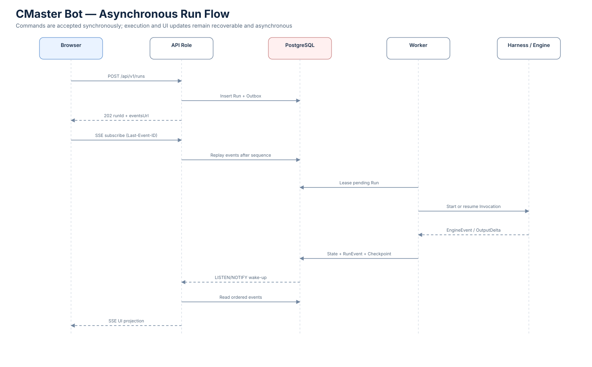

# CMaster Bot 目标架构

> **状态：Accepted / Normative**
>
> 目标：企业 Web-first、服务端执行、可扩展且可增量替换的 Enterprise Assistant。



## 1. 产品与部署边界

- 首要产品形态是企业内网 Web 应用；浏览器不直接访问员工本机 Shell、文件或 MCP 子进程。
- 普通员工使用 **Employee Experience**；其中的 **Workspace** 是 Employee 在 Conversation 前选择的私有文件系统与权限边界。平台管理员使用角色隔离的 **Admin Console**。
- 服务端是模块化单体：一个代码库和部署单元，生产可运行 `api`、`worker` 两种角色，开发可运行 `all`。
- 首个 Production Starter 部署在单台内网服务器，使用 PostgreSQL，以及共享持久的 Artifact 与 Workspace Content Storage；HA Profile 后续替换为多节点、对象存储和专用实时总线。
- 现有原型数据、旧 API 和旧 `ExecutionStep` 不要求兼容。

## 2. 架构原则

1. **稳定领域，替换 Adapter**：框架、SDK、数据库驱动、传输和 Provider 类型不得进入领域模型。
2. **深 Module**：调用者只学习小型公开 Interface；复杂性、事务、错误和策略集中在 Module 内。
3. **真实 Seam 才建 Port**：多模型、多 Engine、多 Tool Provider、生产/测试存储等真实变化点建立 Adapter；不为假想替换制造单方法接口。
4. **Contract-first**：REST、SSE 和 UI Stream 使用独立、版本化、运行时校验的 Contract。
5. **单一权威写路径**：增量迁移期间不长期双写；每个领域对象只有一个 Module 拥有。
6. **安全默认拒绝**：Organization、Principal、Delegation、Policy、Tool Grant 和数据分类共同约束执行。
7. **执行可恢复**：状态表、Run Event、Checkpoint、Outbox、Worker Lease 与 Tool-call Ledger 协同，但不采用完整 Event Sourcing。
8. **升级可验证**：依赖精确锁定；升级经过 Contract、集成测试、Eval 和 Canary，不做服务端自动更新。

## 3. 分层架构



| 层 | 职责 | 禁止事项 |
|---|---|---|
| Experience | Employee Experience、Admin Console、View Model | 不直接调用数据库或 Provider SDK |
| Contract/Transport | REST Command/Query、SSE、AI SDK UI Presenter | 不暴露 Domain Entity 或 ORM Row |
| Application | 用例编排、事务入口、Module Interface | 不依赖 React、Fastify、MCP 等类型 |
| Execution Control | Harness、生命周期、预算、审批、恢复、Outcome | 不实现模型协议或 Tool Provider |
| Runtime Capability | Agent Engine、Model Module、Tool Runtime、Context Builder | 不拥有 Conversation 或 UI 状态 |
| Domain | 业务术语、不变量、状态转换 | 不导入框架、数据库、网络 SDK |
| Persistence/Messaging | Repository、EventStore、Outbox、Dispatcher、LiveEventBus | 不成为跨 Module 直查通道 |
| External Adapters | OIDC、AI SDK、MCP、Artifact、Credential、OTel | 不反向定义领域语义 |
| Infrastructure | PostgreSQL、Volume/S3、内部 IdP、模型和企业系统 | 通过 Adapter 接入 |

依赖总体向内；应用组合根位于 `apps/server`，前端组合根位于 `apps/web`。

## 4. Runtime 与 Harness

Harness 是 Provider-neutral 的执行控制系统。它拥有：

- Run/Invocation 生命周期与父子 Invocation 树
- Agent Revision、Policy Revision 和解析结果固定
- 预算、超时、取消、暂停、Interrupt 与审批
- Checkpoint、Worker 恢复、跨 Invocation 重试和 Outcome 评估
- 标准 Run Event、Output Delta 与审计关联

Harness 不拥有 HTTP、SSE、SQL、Provider SDK、MCP、Workflow 定义或 UI Renderer。

### Vercel AI SDK 接入

AI SDK 通过三个独立 Adapter 使用：

1. Model Gateway 的首个实现
2. 一次 Invocation 内 Tool Loop 的默认 Agent Engine
3. UI Presenter 的首个 Streaming Adapter

AI SDK Tool Wrapper 必须调用统一 Tool Runtime；AI SDK 类型在 Adapter 处转换为 `ModelEvent`、`RunEvent`、`OutputDelta`、`ToolOutcome` 和 UI Projection。

## 5. API/Worker 异步运行



- `POST /api/v1/runs` 在事务中写 Run 和 Outbox，返回 `202 + runId + eventsUrl`。
- Worker 从 PostgreSQL Dispatcher 租约领取 Run，定期 heartbeat，并在安全点写 Checkpoint。
- Browser 通过 SSE 订阅；`Last-Event-ID` 使用 Run sequence 重放。
- PostgreSQL Run Event 是事实来源，`LISTEN/NOTIFY` 仅用于唤醒 API；轮询只作降级。
- Output Delta 按 50–150ms 聚合，避免逐 token 写数据库。
- SSE 断开不取消 Run；取消、暂停、恢复和审批使用独立 Command。

## 6. 模型与 Tool

### Model Module

- Model Catalog 管理企业批准的 Model Profile、能力、上下文、成本和数据策略。
- Model Router 按能力和 Policy 选择 Primary/Fallback；不得通过 Provider 名称散落判断。
- Model Gateway 归一化 Streaming、usage、错误、重试和 Trace。
- Fallback 只能在策略、数据、能力、成本和 Engine 兼容范围内发生，并产生可审计记录。

### Tool Module

- Skill 是版本化指令/资源包，可要求 Tool，但不等于 Tool。
- Tool 是稳定 ID 与输入输出 Contract；Connector 是企业系统连接；MCP 是 Provider 协议。
- Tool Catalog 管理描述、版本、来源和可用状态。
- Tool Runtime 集中执行校验、Policy、Credential Lease、超时、调用、脱敏和 ToolOutcome。
- 仅审查后的 Built-in Tool 可在主进程执行；扩展 Provider 默认运行于隔离 Host。
- Tool-call Ledger 在派发前写入稳定 idempotency key；未知非幂等副作用进入人工/对账恢复，禁止盲重试。
- 外部 Skill 首选 Agent Skills 标准，旧自定义格式只通过 Legacy Adapter 临时读取。

## 7. Filesystem Workspace

- `packages/workspaces` 是 Workspace、Repository Binding、Git Worktree、Workspace Revision、Workspace File metadata、Workspace Change Set、Workspace Operation Mode 和生命周期的唯一 owner。
- Workspace 由一个 Employee Principal 私有拥有；一个 Workspace 可包含多个 Conversation，最多绑定一个 Git Repository，并包含多个隔离 Worktree。
- Conversation 创建前固定 Workspace 和 Working Root；Git-backed Conversation 固定一个 Worktree。Run 固定 base Workspace Revision 和启动时最大 Operation Mode。
- 空 Workspace 与 Git Workspace 的文件/Revisions 是共享持久权威数据；单 Worker 磁盘仅物化 Sandbox，不成为 System of Record。
- 每个文件 Run 在隔离 Sandbox 中只挂载一个固定 Revision 的 Working Root、只读 Runtime 与 Invocation-private temp；Observe 只读，mutating Run 只能写 ephemeral overlay；宿主路径和默认网络不可见。见 ADR-0045。
- overlay 必须 finalize 为不可变 Workspace Change Set；共享权威文件只有 apply transition 一条写路径。Observe 禁写，Edit with Confirmation 等待整个不可变 Change Set 的 Approval，Trusted Automation 仍记录 Change Set 但可由 Policy 自动批准应用。
- Apply、Git Commit、Push、Create PR 与 Merge 是独立受治理动作；Push unknown outcome 不盲重试。
- Workspace File 是可变工作材料；Artifact Version 是明确发布的 Workspace-scoped 不可变交付物，跨 Workspace 使用必须显式治理复制。

## 8. Context 与内容

Context Builder 从 Message、固定 Revision 的 Workspace Files、Working State、Memory、Knowledge、Skill 内容、Artifact 和 Agent Revision 中按 Policy、相关性和 token 预算构造一次 Invocation Context，并保存 Context Manifest。

- Workspace 是文件访问上限，不等于全部文件进入 Prompt；Agent 通过受治理 list/search/read Tool 按需读取，Manifest 记录实际 File/Revision 来源。
- `.cmasterignore` 是强访问限制；Git Workspace 同时参考 `.gitignore`，默认排除 `.git`、Secret、依赖缓存、构建产物、二进制和超限文件。
- Conversation History 是完整事实，不等于每次模型上下文。
- Run 引用 Message ID，不复制历史内容。
- Summary 是派生数据，不替代 Message。
- Memory 不是权威 Knowledge；Tool Output 不自动进入 Memory。
- Engine Adapter 将中立 Context 转换为供应商消息格式。

Artifact 是版本化一等对象。元数据存 PostgreSQL，内容经可替换存储 Adapter；首版目录为：

```text
data/artifacts/
├── blobs/sha256/{aa}/{bb}/{hash}
├── derivatives/{content-hash}/...
├── staging/{run-id}/*.part
├── quarantine/{date}/...
└── trash/{date}/...
```

业务只持有 `contentId`；本地路径不进入 Domain 或 Contract。该目录是 Adapter 的目标布局而非要求预建空能力：Slice 4 实现 staging、正式 Blob 与过期 staging 清理；quarantine、derivatives、trash 在文件上传、预览、删除/GC 出现真实调用者时按此布局延后启用。

## 9. 身份、安全与治理

- 内部 OIDC Provider 通过 Authorization Code + PKCE 接入；浏览器使用 HttpOnly/Secure/SameSite Session Cookie。
- API 从可信 Session 建立 `organizationId/principalId/roles/correlationId`，不接受客户端自行声明。
- Agent 代表 Principal 受限 Delegation；子 Invocation 只能保持或缩小权限。
- Conversation 继承 Workspace owner 的 Principal-private 边界；Organization scope 不构成共享授权。本 Slice 不提供协作，未来能力必须引入新的显式模型，不能放宽现有读取。
- 有效权限是 Organization Policy、Principal Entitlement、Agent Grant、Tool Policy 和 Invocation 限制的交集。
- Policy Module 返回 allow/deny 及 approval、redaction、model restriction、network restriction 等 obligation；首版进程内实现，OPA/Cedar 后置。
- Connector 只保存 Credential Reference；完整企业 Credential Broker 实现优先级较低，但接口不可绕过。
- 员工 UI 展示执行透明度而非原始 Chain-of-Thought；未来 Diagnostic Trace 独立、默认关闭、短期加密保留并审计访问。

## 10. 数据与一致性

- PostgreSQL 是生产 System of Record；SQLite 仅作为开发调试 Adapter。
- 各 Module 拥有自己的 Schema 和 Repository，禁止跨 Module 直查表。
- 当前状态表用于查询；append-only Run Event 用于时间线；Checkpoint 用于恢复；Outbox 用于可靠发布。
- Event 采用 at-least-once，前端按 `eventId` 去重，同一 Run sequence 严格有序。
- 数据模型、Persistence Model 和 Contract Model 分离并集中映射。

## 11. 可观测性、质量与 UI

- OTel 统一 Trace/Metric/Log，但 Run Event 不等于 Trace。
- Prompt、Tool 参数和 Artifact 内容默认不进入遥测。
- Eval Suite 覆盖 Contract、Regression、Capability、Safety、Cost 和 Performance；Revision 经过 Evidence、Review 和 Canary 后激活。
- 前端按 Feature 组织，区分 Query Cache、Streaming Projection 和 Local UI State；Server State 首版使用 TanStack Query，Run UI Projection 使用 Snapshot + sequence stream 恢复。
- Employee Experience 使用 CMaster-owned、版本化 UI Projection Contract；canonical Run Event 和 AI SDK UI 类型都不成为 React Feature Contract。
- Filesystem Workspace 体验采用已确认的 Balanced Workspace：左侧 Workspace/Worktree/Conversation 导航，中间 Conversation，右侧持久 Overview/Files/Changes/Artifacts Work Area。
- 生产 UI 使用官方 AI Elements Registry + shadcn/ui + Tailwind CSS + Lucide Icons；框架类型停留在 Experience 层，Message/Run/Approval/Workspace Change Set/Artifact 状态仍由 CMaster 拥有，默认 `useChat` 不接管生命周期。
- Renderer Registry 扩展 Tool/Artifact/Run 视图，未知类型使用通用 Fallback。
- 员工端桌面完整、移动端覆盖核心流程；管理端桌面优先；实际交付 zh-CN/en-US、System/Light/Dark，并以 WCAG 2.2 AA 为验收。

## 12. Production Starter 基线

- 最多 1,000 注册、300 DAU、100 同时在线。
- 默认 20、可配置 50 个并发 Run；单 Organization 每日 10,000 Run。
- 普通 Run 默认 10 分钟，后台自动化默认 2 小时。
- Command/普通 Query p95 < 500ms（不含 IdP/模型），SSE 恢复 p95 < 2s。
- Starter 可用性 99.5%，RPO ≤ 24h，RTO ≤ 4h。
- Run Event 默认 90 天，审计默认 1 年；均由企业策略覆盖。

## 13. 明确延后

以下选型在对应 Slice 开始前再评估，不得提前渗入稳定 Contract：ORM/Query Builder、AI SDK 精确版本、具体内部 IdP、OPA/Cedar、企业 Vault、向量数据库、Redis/NATS、S3 产品、Kubernetes/OpenShift、Workflow 编辑器和最终视觉稿。
