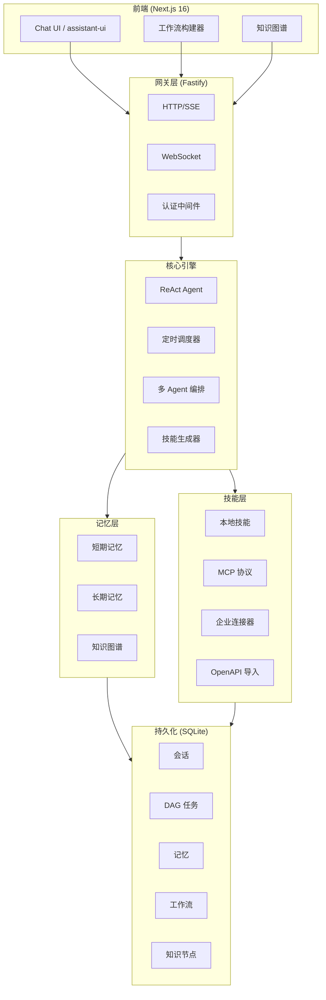

# CMaster Bot — 技术架构说明

## 系统概述

CMaster Bot 采用分层架构设计：Next.js 前端通过 HTTP/SSE/WebSocket 与 Fastify 网关通信，网关将请求委托给核心 ReAct Agent，Agent 负责编排 LLM 调用、技能执行和记忆操作，所有数据持久化于本地 SQLite 数据库。

---

## 系统架构图



---

## 各层组件说明

### 前端（Next.js 16）

**技术栈：** Next.js 16 App Router、React 19、Tailwind CSS 4、shadcn/ui

前端是一个单页应用，代码位于 `web/` 目录。开发模式下运行在独立开发服务器（端口 3001）；生产模式下由后端直接托管 `web/out/` 中编译好的静态产物。

| 组件 | 文件路径 | 职责 |
|------|----------|------|
| 聊天界面 | `web/src/app/chat/` | 基于 `@assistant-ui/react` 的主对话界面 |
| SSE 适配器 | `web/src/lib/assistant-runtime.ts` | 自定义 `ChatModelAdapter`，消费后端 SSE 流 |
| 技能页面 | `web/src/app/skills/` | 三标签视图：活跃技能、MCP 来源、MCP 注册中心 |
| 记忆页面 | `web/src/app/memory/` | 长期记忆浏览与管理 |
| 设置页面 | `web/src/app/settings/` | 各提供商 LLM 配置、嵌入模型、认证设置 |
| 工具卡片 | `web/src/components/tool-ui.tsx` | 对话中渲染工具调用/结果的可视卡片 |
| 会话侧边栏 | `web/src/components/` | 会话列表，支持标题编辑和消息反馈 |

SSE 适配器处理以下后端 chunk 类型：

```typescript
type ChunkType =
  | 'content'        // 助手文本输出（流式）
  | 'thought'        // 内部推理过程（折叠展示）
  | 'plan'           // 任务规划展示
  | 'action'         // 工具调用详情
  | 'observation'    // 工具执行结果
  | 'answer'         // 最终答案标记
  | 'task_created'   // DAG 任务节点创建
  | 'task_completed' // DAG 任务节点完成
  | 'task_failed'    // DAG 任务节点失败
  | 'meta'           // 会话元数据更新
  | 'suggestions'    // 动态后续建议问题
```

---

### 网关层（Fastify）

**技术栈：** Fastify 5、fastify-static、@fastify/cors

网关是所有客户端连接的统一入口，负责协议复用、认证鉴权和请求路由。

**入口文件：** `src/gateway/server.ts`

#### API 端点

| 方法 | 路径 | 说明 |
|------|------|------|
| GET | `/health` | 健康检查（认证豁免） |
| POST | `/api/chat` | 非流式聊天 |
| POST | `/api/chat/stream` | SSE 流式聊天 |
| GET/POST | `/ws` | WebSocket 聊天 |
| GET/POST/DELETE | `/api/mcp/config` | MCP 服务管理 |
| GET/POST | `/api/sessions` | 会话列表与创建 |
| GET | `/api/sessions/:id/messages` | 消息历史（支持分页） |
| PATCH | `/api/sessions/:id/title` | 重命名会话 |
| POST | `/api/feedback` | 提交消息反馈 |
| GET/POST/DELETE | `/api/registry/*` | MCP 注册中心端点 |
| GET/POST/DELETE | `/api/connectors` | 企业连接器管理 |
| GET/POST/DELETE | `/api/scheduled-tasks` | 定时任务管理 |
| POST/GET | `/api/knowledge/*` | 知识图谱接入与检索 |
| GET/POST/DELETE | `/api/workflows` | 工作流管理 |
| POST | `/api/skills/generate` | AI 自动生成技能 |

#### 认证中间件（`src/gateway/auth.ts`）

支持两种模式（默认禁用）：
- **API Key 模式**：校验 `X-API-Key` 请求头是否在配置的密钥列表中
- **JWT 模式**：校验 `Authorization: Bearer <token>`，使用配置的密钥验签

两种模式均放行 `/health` 端点。

---

### 核心引擎

#### ReAct Agent（`src/core/agent.ts`）

Agent 以 `async function*` 生成器实现 Reason + Act（ReAct）模式，支持将中间步骤实时流式传输到前端。

**ReAct 循环：**

```
用户消息
    ↓
[思考] LLM 推理下一步行动
    ↓
[行动] LLM 选择工具和参数
    ↓
[观察] 工具执行，返回结果
    ↓
（循环直至 LLM 产出最终答案）
    ↓
[答案] 最终回复流式输出给用户
```

**内置工具：**

| 工具 | 说明 |
|------|------|
| `plan_task` | 将复杂请求拆解为结构化执行计划 |
| `memory_remember` | 将重要信息存入长期记忆 |
| `memory_recall` | 从长期记忆中检索相关信息 |
| `dag_create_task` | 在任务 DAG 中创建子任务节点 |
| `dag_get_status` | 查询 DAG 任务状态 |
| `dag_execute` | 触发 DAG 并行执行 |
| `skill_generate` | AI 自动生成并热加载新技能 |
| `delegate_to_agent` | 将子任务委托给专属工作者 Agent |
| `knowledge_search` | 在知识图谱中进行多跳语义检索 |

**工具调用策略：** 内置工具顺序执行；外部技能工具通过 `Promise.allSettled` 并行执行。

#### 上下文管理器（`src/core/context-manager.ts`）

通过两阶段策略防止上下文窗口溢出：
1. **滑动窗口**：在 token 预算内保留最近 N 条消息
2. **LLM 摘要压缩**：窗口满时，由 LLM 将旧消息压缩为紧凑上下文块

使用 CJK 感知分词器（`src/core/tokenizer.ts`），确保中英文混合文本的 token 计数准确。

---

### 技能层

#### 技能协议

每个技能是一个目录，包含：
- `SKILL.md` — YAML frontmatter（名称、版本、描述、作者）+ Markdown 格式的动作定义
- `index.ts` — TypeScript 实现，导出各动作的处理函数

`SKILL.md` frontmatter 示例：

```yaml
---
name: http-client
version: 1.0.0
description: HTTP 请求技能，用于调用外部 API
author: built-in
---
```

#### 技能加载器（`src/skills/loader.ts`）

扫描三个技能目录下的 `SKILL.md` 文件，使用 `gray-matter` 解析元数据，动态导入 `index.ts` 实现，并注册技能。支持 `reloadSkill()` 零停机热重载。热重载时直接向已有的 `local-files` source 追加新技能，避免覆盖原有技能。

#### 技能注册中心（`src/skills/registry.ts`）

多源技能聚合中心，管理：
- **LocalSkillSource**：来自 `skills/built-in/`、`skills/installed/`、`skills/local/` 的本地技能
- **McpSkillSource**：已连接 MCP 服务器暴露的工具
- **ConnectorSkillSource**：企业连接器（YAML/JSON 配置）暴露的 HTTP 接口

将技能动作定义转换为 LLM 工具调用 Schema（JSON Schema 格式），并通过 `SkillContext` 分发 `execute()` 调用。

#### MCP 客户端（`src/skills/mcp-source.ts`）

实现 Model Context Protocol 客户端，支持三种传输协议：
- `stdio`：启动子进程，通过 stdin/stdout 通信
- `sse`：连接 HTTP SSE 端点
- `streamable-http`：HTTP 流式传输

具备指数退避重连和运行时动态注册/注销能力。

#### Shell 沙箱（`src/skills/sandbox.ts`）

在执行 Shell 命令前进行安全校验：
- **黑名单模式**（默认）：拦截已知危险模式（`rm -rf /`、`mkfs`、Fork 炸弹 `:(){ :|:& };:` 等）
- **白名单模式**：仅允许配置列表中明确列出的命令前缀

---

### 记忆层

#### 短期记忆（`src/memory/short-term.ts`）

进程内、按会话隔离的键值存储：
- 会话数量超过配置上限时触发 LRU 淘汰
- 支持按条目配置 TTL，惰性过期
- 由 `SessionMemoryManager` 统一管理多会话隔离

#### 长期记忆（`src/memory/long-term.ts`）

SQLite 持久化的语义记忆：
- 条目存储于 `long_term_memories` 表，包含文本和嵌入向量（JSON 数组）
- **检索**：查询嵌入与存储向量的余弦相似度；嵌入不可用时回退到 SQL `LIKE` 查询
- **自动注入**：每次请求时将 top-3 相关记忆自动追加到系统提示词中

#### 知识图谱（`src/memory/knowledge-graph.ts`）

企业知识库的图结构存储与检索：
- **摄入**：文档分块 → 嵌入 → LLM 实体关系抽取 → 构建知识图谱
- **检索**：向量相似度检索（top-K）→ 图遍历（BFS，可配置跳数）→ 返回上下文子图
- **GraphRAG 优势**：相比纯平面向量检索，多跳问题的回答质量显著提升

---

### 数据库层（`src/core/database.ts`）

单一 SQLite 文件，路径 `data/cmaster.db`，使用 `node:sqlite` 的 `DatabaseSync`（同步 API，零异步开销），WAL 日志模式以提升并发读性能。

#### 数据库表结构

```sql
-- 对话会话
CREATE TABLE sessions (
    id TEXT PRIMARY KEY,
    title TEXT,
    is_pinned INTEGER DEFAULT 0,
    created_at DATETIME DEFAULT CURRENT_TIMESTAMP,
    updated_at DATETIME DEFAULT CURRENT_TIMESTAMP
);

-- 聊天消息（role: user | assistant | tool）
CREATE TABLE messages (
    id TEXT PRIMARY KEY,
    session_id TEXT REFERENCES sessions(id) ON DELETE CASCADE,
    role TEXT NOT NULL,
    content TEXT,
    tool_call_id TEXT,
    tool_calls TEXT,   -- JSON 格式
    created_at DATETIME DEFAULT CURRENT_TIMESTAMP
);

-- 文件/图片附件
CREATE TABLE attachments (
    id TEXT PRIMARY KEY,
    message_id TEXT REFERENCES messages(id) ON DELETE CASCADE,
    name TEXT,
    type TEXT,
    url TEXT,
    base64 TEXT
);

-- DAG 任务节点
CREATE TABLE tasks (
    id TEXT PRIMARY KEY,
    session_id TEXT,
    title TEXT,
    description TEXT,
    status TEXT DEFAULT 'pending',  -- pending | running | completed | failed
    dependencies TEXT,              -- JSON 任务 ID 数组
    result TEXT,
    error TEXT,
    created_at DATETIME DEFAULT CURRENT_TIMESTAMP,
    updated_at DATETIME DEFAULT CURRENT_TIMESTAMP
);

-- 长期记忆条目
CREATE TABLE long_term_memories (
    id TEXT PRIMARY KEY,
    content TEXT NOT NULL,
    embedding TEXT,  -- JSON 浮点数组
    tags TEXT,       -- JSON 字符串数组
    created_at DATETIME DEFAULT CURRENT_TIMESTAMP
);

-- 消息反馈
CREATE TABLE feedback (
    id TEXT PRIMARY KEY,
    message_id TEXT,
    session_id TEXT,
    rating TEXT,     -- positive | negative
    created_at DATETIME DEFAULT CURRENT_TIMESTAMP
);

-- 定时任务
CREATE TABLE scheduled_tasks (
    id TEXT PRIMARY KEY,
    name TEXT NOT NULL,
    cron_expr TEXT NOT NULL,
    prompt TEXT NOT NULL,
    session_id TEXT,
    enabled INTEGER DEFAULT 1,
    last_run TEXT,
    next_run TEXT,
    created_at TEXT NOT NULL,
    updated_at TEXT NOT NULL
);

-- 知识图谱节点
CREATE TABLE knowledge_nodes (
    id TEXT PRIMARY KEY,
    type TEXT,
    title TEXT,
    content TEXT,
    metadata TEXT,   -- JSON
    embedding TEXT,  -- JSON 浮点数组
    created_at DATETIME DEFAULT CURRENT_TIMESTAMP,
    updated_at DATETIME DEFAULT CURRENT_TIMESTAMP
);

-- 知识图谱边
CREATE TABLE knowledge_edges (
    id TEXT PRIMARY KEY,
    from_id TEXT REFERENCES knowledge_nodes(id),
    to_id TEXT REFERENCES knowledge_nodes(id),
    relation TEXT,
    weight REAL DEFAULT 1.0,
    created_at DATETIME DEFAULT CURRENT_TIMESTAMP
);

-- 工作流定义
CREATE TABLE workflows (
    id TEXT PRIMARY KEY,
    name TEXT NOT NULL,
    description TEXT,
    definition TEXT,  -- JSON 工作流节点与边
    created_by TEXT,
    created_at DATETIME DEFAULT CURRENT_TIMESTAMP,
    updated_at DATETIME DEFAULT CURRENT_TIMESTAMP
);
```

---

## 数据流详解

### 流式聊天请求

```
浏览器（EventSource）
    │
    │  POST /api/chat/stream  {sessionId, message}
    ▼
Fastify 网关
    │  认证校验（如已启用）
    │  从 SQLite 加载会话历史
    │  注入 top-3 长期记忆到系统提示
    ▼
ReAct Agent（async generator）
    │
    ├─► yield {type: 'thought', content: '...'}      ──► SSE chunk → 浏览器
    │
    ├─► LLM 工具调用决策
    │       │
    │       ├─ 内置工具（顺序执行）
    │       │   └─ plan_task / memory_recall / dag_create_task / skill_generate ...
    │       │
    │       └─ 外部技能（Promise.allSettled 并行执行）
    │           └─ SkillRegistry.execute(skillName, action, params)
    │               └─ skill/index.ts 动作函数
    │
    ├─► yield {type: 'action', ...}                  ──► SSE chunk → 浏览器
    ├─► yield {type: 'observation', ...}             ──► SSE chunk → 浏览器
    │
    └─► yield {type: 'answer', content: '...'}       ──► SSE chunk → 浏览器

    流结束后，消息持久化到 SQLite
```

### 技能热重载

```
文件系统变更（或 API 调用 /api/skills/:name/reload）
    ↓
从注册中心获取已有 local-files source
    ↓
source.loadSkill(dir)  →  重新读取 SKILL.md + 动态 import() index.ts
    ↓
技能 Map 中的条目就地更新（不替换整个 source）
    ↓
下一次 LLM 调用即携带更新后的工具 Schema（无需重启服务）
```

### AI 自动技能生成

```
用户描述需求（自然语言）
    ↓
Agent 调用内置工具 skill_generate
    ↓
SkillGenerator.generate()
    ├─ 构建结构化提示词（含 SKILL.md 格式规范）
    ├─ 调用 LLM，输出 JSON: { skillMd, indexTs }
    └─ 解析并写入 skills/local/<name>/ 目录
    ↓
热重载：向已有 local-files source 追加新技能
    ↓
Agent 在同一对话轮次内即可调用该新技能
```

---

## 关键设计决策

### 1. 使用 `node:sqlite` 而非 better-sqlite3
内置的 `node:sqlite` 模块（Node.js 22+）消除了原生插件编译，简化了部署（无需编译 native binaries），并移除了 `@types/better-sqlite3` 依赖。同步 `DatabaseSync` API 是有意为之：SQLite 操作足够快，引入异步开销反而增加无谓复杂度。

### 2. Async Generator 实现流式输出
ReAct 循环采用 `async function*` 生成器，使网关层能够 `for await` 迭代执行步骤，并将每个步骤立即作为 SSE 事件推送，让用户实时看到 Agent 的推理过程，无需等待完整响应。

### 3. SKILL.md 协议（而非纯代码插件）
用 Markdown + YAML frontmatter 定义技能，使技能做到自文档化、diff 友好、人机可读。LLM 可以阅读 `SKILL.md` 来理解现有技能的结构，从而在生成新技能时形成自参考的引导闭环（Auto-Skill Generator 的基础）。

### 4. MCP 作为外部工具集成标准
CMaster 采用 Model Context Protocol 作为外部工具集成的标准协议，而非发明私有插件规范。这使系统可以直接接入持续增长的 MCP 生态（数据库、代码工具、API 等），无需任何自定义适配器开发。

### 5. SQLite 作为唯一数据库依赖
所有持久化——会话、消息、任务、记忆、知识图谱——均存储在单个 SQLite 文件中。这使系统在零基础设施依赖下即可部署：无需 Redis、无需 PostgreSQL、无需向量数据库服务。如需企业级扩展，架构设计上支持将各存储层（如长期记忆）替换为外部服务，而无需改动 Agent 接口。

### 6. SSE content array 纯文本策略
前端 SSE 适配器的 content array 仅包含文本内容，tool-call/tool-result 的显示由 `ChatThinking` 组件通过 `metadata.custom.steps` 独立处理。这避免了 `@assistant-ui/react` 的 tool 状态机将消息误判为"tool roundtrip 完成"，确保工具调用后的最终文本能够正常流式渲染。
